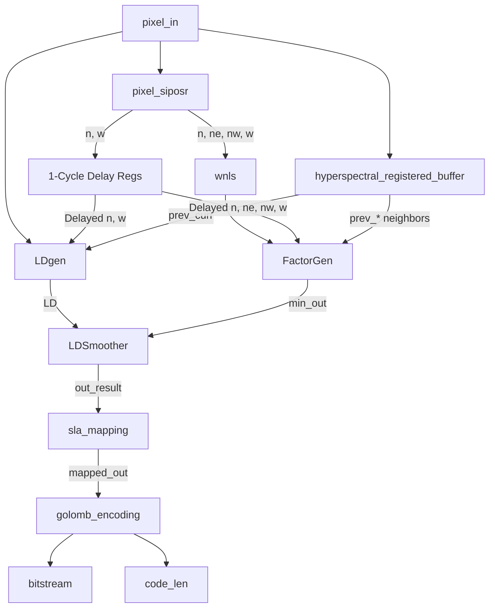
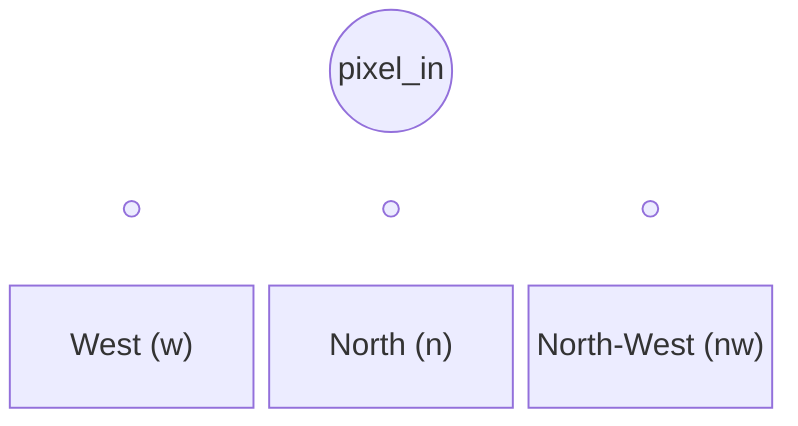

# SLA Hyperspectral Data Compressor

This repository contains the Verilog implementation of a Simple Lossless Algorithm (SLA) for on-board satellite hyperspectral data compression. 

---

## 1. Top-Level Integration (`image_compression_top`)

The top-level module stitches together the spatial delay lines, spectral buffer, predictor logic, and encoders into a fully pipelined architecture. 

Pipeline:
1. Pn-1 16 bit pixel enters the SIPOSR and it outputs the neighbours of Pn and sends it to the WNLS block for WNLS calculation. It also buffers the result for other blocks.
2. Pn pixel enters the bitstream and is sent to BRAM, LDgen and FactorGen. Bram outputs previous spectral pixel of current pixel location and sends to FactorGen and LDGen. buffered input from previous step is sent to both blocks as well. WNLS output is sent to FactorGen.
3. LDGen and FactorGen outputs are sent to LDSmoother for final smoothing to compress further.
4. The output of the smoother is sent to the mapping blocks which maps each number(positive or negative) into a positive number.
5. This output is sent to the Goloumb encoder which outputs the final compressed code bitstream along with the valid length.

### Top-Level Block Diagram

---

## 2. Module Descriptions

Below is a detailed breakdown of each module, its inputs/outputs, and its function.

### A. `pixel_siposr` (Spatial Neighborhood Generator)
Generates the spatial neighborhood for the current pixel using a Shift-In-Parallel-Out Shift Register (SIPOSR).
* **Inputs:** 
  * `clk`, `rst_n`, `en`: Control signals.
  * `pixel_in`: The incoming image pixel.
* **Outputs:** 
  * `pixel_w`, `pixel_nw`, `pixel_n`, `pixel_ne`: The West, North-West, North, and North-East neighbors.
* **Function:** It takes in 16 bit pixel values serially and outputs the neighbours of the next pixel so that the WNLS block can calculate the required value one cycle in advance.

### B. `hyperspectral_registered_buffer` (Spectral Buffer)
Buffers an entire image band (frame) to provide the spectral neighbors for the current pixel.
* **Inputs:** 
  * `clk`, `rst`, `valid_in`
  * `din`: The incoming image pixel.
* **Outputs:** 
  * `curr_pixel`: Registered current pixel.
  * `prev_curr`, `prev_west`, `prev_ne`, `prev_north`, `prev_nw`: The exact spatial neighbors, but from the *previous* hyperspectral band.
* **Function:** Uses Dual-Port Block RAM (BRAM) of size `IMAGE_WIDTH * IMAGE_HEIGHT` combined with a small SIPO register to fetch the previous frame's pixels and align them with the current pixel for 3D/spectral prediction.

### C. `wnls` (Local Spatial Predictor)
* **Inputs:** 
  * `n`, `ne`, `nw`, `w`: Spatial neighbors from SIPOSR.
* **Outputs:** 
  * `out_flop`: The averaged prediction value.
* **Function:** Adds the four spatial neighbors and divides by 4 (using a 2-bit right shift) to create a base spatial prediction for the current pixel.

### D. `LDgen` (Local Difference Generator)
* **Inputs:** 
  * `curr`: The current pixel being compressed.
  * `n`, `w`: Spatial North and West neighbors.
  * `spect`: The corresponding pixel from the previous spectral band.
  * `sel`: 2-bit MUX selector.
* **Outputs:** 
  * `result_out`: The chosen local difference (LD).
* **Function:** Computes the difference between the current pixel and one of its immediate neighbors (North, West, or Spectral). The MUX selects which difference to forward to the smoother.

### E. `FactorGen` (Smoothing Factor Generator)
* **Inputs:** 
  * `wnls`: The spatial average.
  * `n_curr`, `w_curr`, `nw_curr`, `ne_curr`: Current band neighbors.
  * `n_prev`, `nw_prev`, `ne_prev`, `w_prev`, `curr_prev`: Previous band neighbors.
* **Outputs:** 
  * `min_out`: The minimum computed difference.
* **Function:** Performs 9 concurrent subtractions between the `wnls` average and all available neighbors (both spatial and spectral). It routes these differences through a combinational minimum-tree to find the smallest difference, which acts as the smoothing factor.

### F. `LDSmoother` (Local Difference Smoother)
* **Inputs:** 
  * `LD`: Local difference from `LDgen`.
  * `smoothing_factor`: The minimum difference from `FactorGen`.
* **Outputs:** 
  * `out_result`: The smoothed prediction residual.
* **Function:** Subtracts the smoothing factor from the base Local Difference to tighten the prediction error distribution around zero.

### G. `sla_mapping` (Error Mapping)
* **Inputs:** 
  * `a`: The signed residual from `LDSmoother`.
* **Outputs:** 
  * `mapped_out`: An unsigned mapped integer.
* **Function:** Golomb encoding requires positive integers. This module maps signed residuals to positive integers using the standard rule:
  - If `a >= 0`, output `2 * a`
  - If `a < 0`, output `2 * |a| - 1`

### H. `golomb_encoding` (Golomb-Rice Encoder)
* **Inputs:** 
  * `mapped_in`: The unsigned mapped residual.
* **Outputs:** 
  * `bitstream`: The variable-length compressed bits.
  * `code_len`: The number of valid bits in the bitstream.
* **Function:** Implements Golomb-Rice encoding with a divisor of $2^K$. It splits the mapped residual into a quotient and a remainder. It outputs the quotient as a Unary code (a string of '1's followed by a '0'), followed by the binary remainder. The code_len tells how many bits of the output is valid. 
