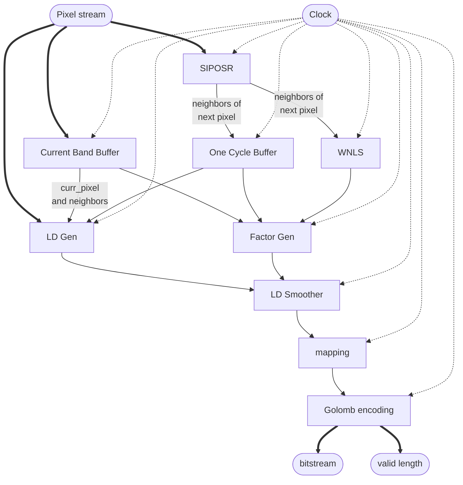
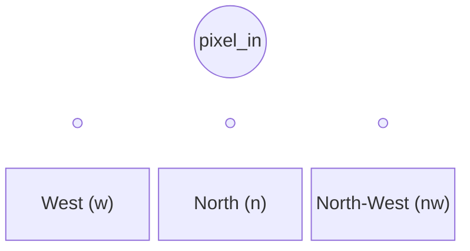

# SLA Hyperspectral Data Compressor

This repository contains the Verilog implementation of a Simple Lossless Algorithm (SLA) for on-board satellite hyperspectral data compression. The design leverages spatial neighborhood pixels to predict the current pixel, calculates the residual error, and compresses the data using Golomb-Rice encoding.

---

## 1. Top-Level Integration (`image_compression_top`)

The top-level module stitches together the spatial delay lines, predictors, and encoders into a fully pipelined architecture. 

### Top-Level Block Diagram

---

## 2. Module Descriptions

Below is a detailed breakdown of each module, its inputs/outputs, and its function.

### A. `pixel_siposr` (Spatial Neighborhood Generator)
Generates the spatial neighborhood for the current pixel using a Shift-In-Parallel-Out Shift Register (SIPOSR).
* **Inputs:** 
  * `clk`, `rst_n`, `en`: Control signals.
  * `pixel_in`: The incoming image pixel.
* **Outputs:** 
  * `pixel_w`, `pixel_nw`, `pixel_n`, `pixel_ne`: The West, North-West, North, and North-East neighbors.
* **Function:** Uses a shift register of depth equal to `IMAGE_WIDTH` to delay the incoming pixels, naturally forming the spatial neighborhood needed for prediction.

### B. `hyperspectral_current_band_buffer` (Spatial Buffer)
*Note: This module was previously a BRAM-based spectral buffer but has been updated to a lightweight spatial shift register.*
* **Inputs:** 
  * `clk`, `rst`, `valid_in`
  * `din`: The incoming image pixel.
* **Outputs:** 
  * `curr_pixel`: Registered current pixel (1-cycle delayed).
  * `curr_west`, `curr_ne`, `curr_north`, `curr_nw`: The exact spatial neighbors for the current band.
* **Function:** Uses a lightweight SIPO shift register to store spatial neighbors of the current band, replacing the heavy BRAM implementation to save resources.

### C. `wnls` (Local Spatial Predictor)
* **Inputs:** 
  * `n`, `ne`, `nw`, `w`: Spatial neighbors from SIPOSR.
* **Outputs:** 
  * `out_flop`: The averaged prediction value.
* **Function:** Adds the four spatial neighbors and divides by 4 (using a 2-bit right shift) to create a base spatial prediction for the current pixel.

### D. `LDgen` (Local Difference Generator)
* **Inputs:** 
  * `curr`: The current pixel being compressed.
  * `n`, `w`: Spatial North and West neighbors.
  * `spect`: Now wired to the delayed current pixel (`curr_pixel_w`).
  * `sel`: 2-bit MUX selector.
* **Outputs:** 
  * `result_out`: The chosen local difference (LD).
* **Function:** Computes the difference between the current pixel and one of its immediate neighbors. The MUX selects which difference to forward to the smoother.

### E. `FactorGen` (Smoothing Factor Generator)
* **Inputs:** 
  * `wnls`: The spatial average.
  * `n_curr`, `w_curr`, `nw_curr`, `ne_curr`: Spatial neighbors from SIPOSR.
  * `n_prev`, `nw_prev`, `ne_prev`, `w_prev`, `curr_prev`: Now mapped to the current band's spatial neighbors from the new buffer.
* **Outputs:** 
  * `min_out`: The minimum computed difference.
* **Function:** Performs 9 concurrent subtractions between the `wnls` average and all available neighbors. It routes these differences through a combinational minimum-tree to find the smallest difference, which acts as the smoothing factor.

### F. `LDSmoother` (Local Difference Smoother)
* **Inputs:** 
  * `LD`: Local difference from `LDgen`.
  * `smoothing_factor`: The minimum difference from `FactorGen`.
* **Outputs:** 
  * `out_result`: The smoothed prediction residual.
* **Function:** Subtracts the smoothing factor from the base Local Difference to tighten the prediction error distribution around zero.

### G. `sla_mapping` (Error Mapping)
* **Inputs:** 
  * `a`: The signed residual from `LDSmoother`.
* **Outputs:** 
  * `mapped_out`: An unsigned mapped integer.
* **Function:** Golomb encoding requires positive integers. This module maps signed residuals to positive integers using the standard rule:
  - If `a >= 0`, output `2 * a`
  - If `a < 0`, output `2 * |a| - 1`

### H. `golomb_encoding` (Golomb-Rice Encoder)
* **Inputs:** 
  * `mapped_in`: The unsigned mapped residual.
* **Outputs:** 
  * `bitstream`: The variable-length compressed bits.
  * `code_len`: The number of valid bits in the bitstream.
* **Function:** Implements Golomb-Rice encoding with a divisor of $2^K$. It splits the mapped residual into a quotient and a remainder. It outputs the quotient as a Unary code (a string of '1's followed by a '0'), followed by the binary remainder.
